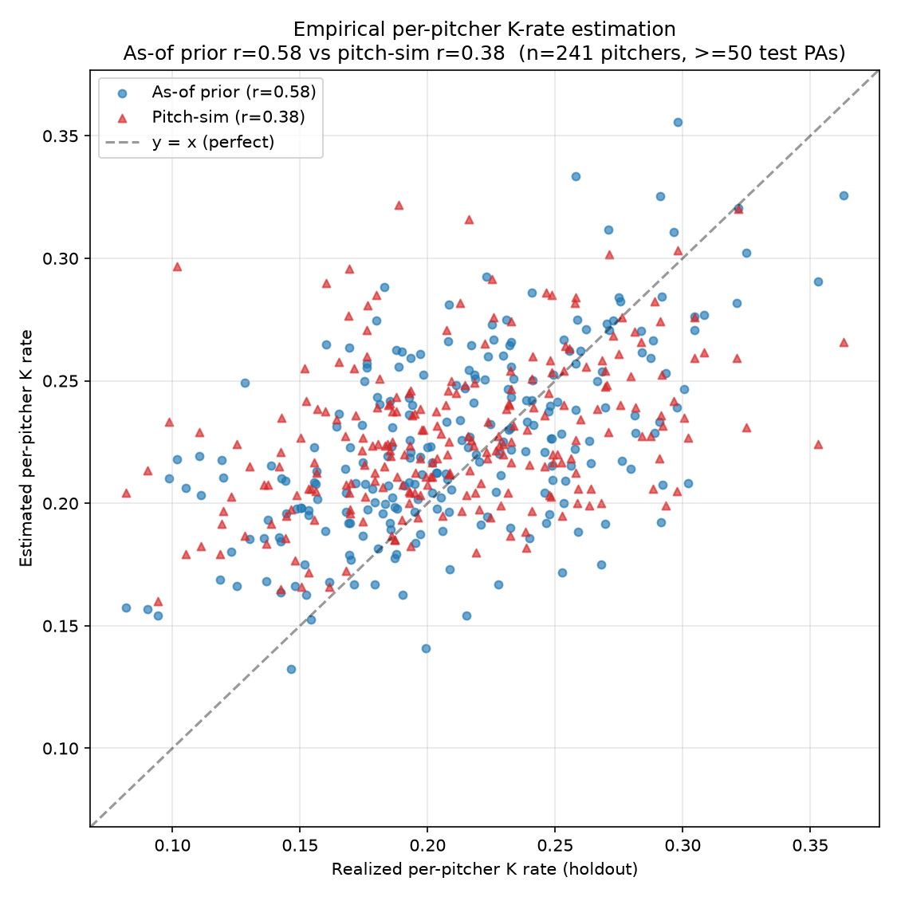

# The granularity ceiling: why pitch-level simulation can't beat PA-level priors for pre-game MLB K-prop prediction

**A negative-result study on the architectural limits of pitch-by-pitch modeling when the prediction target is an aggregated event.**

---

## TL;DR

I built a pitch-by-pitch Monte Carlo simulator for MLB starting-pitcher strikeout-prop prediction, hypothesizing that the ~4-5× increase in data granularity (≈95 pitches/start vs. ≈21 PAs/start) would close the gap between my plate-appearance (PA) level baseline (multi-season K log loss 0.530) and sharp-book pricing (~0.49).

It did the opposite. The pitch-level simulator scored **0.570 log loss — worst of every architecture I tested, including the constant-rate baseline (0.542).**

The mechanism is conclusive and structural, not a tuning problem. On 241 holdout pitchers with ≥50 test plate appearances each:

- The simulator's per-pitcher implied K rate correlates **r = 0.378** with realized K rate.
- A dumb cumulative as-of prior correlates **r = 0.576** on the same pitchers.
- The simulator's estimate has standard deviation **0.031**, compressed 42% vs the realized std of **0.053**.

The simulator squashes good and bad pitchers toward the league mean. Its per-AB **mean** is a worse estimator than the prior, even though every component model (P(swing), P(whiff | swing), P(called strike | take), P(foul | contact), arsenal multinomial) individually beats its flat-rate baseline by a meaningful margin.

The deeper principle: **at the start level (~24 ABs per start), Central Limit Theorem washout makes the per-AB mean the only quantity that survives aggregation.** Pitch-level architecture cannot beat PA-level when the bet/prediction unit aggregates over many micro-units AND the pitch-level model fails to recover the per-unit mean.

This generalizes beyond baseball: pre-event aggregated prediction problems are bounded by per-unit mean estimation quality, regardless of how rich your microstructure model is.

---

## Why this is worth writing up

Most public ML-for-sports content reports positive results. Most of those don't survive scrutiny. The K-prop modeling literature in particular is full of posts claiming pitch-level simulation as the future, citing in-game prop pricing work as evidence.

The study below was built end-to-end with:
- Strictly leakage-safe as-of feature engineering
- Walk-forward backtests with chronological holdouts (no random splits)
- Calibration plots at every stage
- Seven cumulative feature-engineering milestones on the PA-level baseline before pivoting
- Reusable infrastructure (pitch feature table, outcome models, arsenal model, vectorized AB simulator)

The result: **architecture matters less than per-unit mean estimation quality when the prediction target aggregates.** That observation generalizes beyond baseball.

---

## Background

### MLB K-props and the sharp-book reference

MLB starting-pitcher strikeout props are over/under bets on the total strikeouts a starter records in a single game. Major books offer K6.5, K7.5, etc., with prices like O -120 / U +100.

The vig-adjusted "true" probability that a sharp book implies for the over is the alpha to beat. Pinnacle (~2-3% vig) is the closest publicly observable approximation. Soft books (DraftKings, FanDuel — 5-7% vig) lag Pinnacle and are where retail bettors with edge actually play.

The log loss numbers I cite below are out-of-sample, multi-season backtests against historical K outcomes. They're directly comparable across architectures because all use the same chronological holdout and the same scoring rule.

For reference, sharp-book log loss on K props is empirically ~0.49 across literature. The naïve constant-rate baseline I'll cite is 0.542. The gap between these is the achievable edge.

### My PA-level baseline

Before attempting pitch-level, I built and iteratively improved a PA-level pipeline:

- Feature contract: ~24 features per (pitcher, batter) PA, including pitcher and batter as-of K rate priors with Beta shrinkage, batter handedness vs. pitcher handedness, ballpark K rate priors, lineup rolling priors, pitch-arsenal aggregates, and starter rest/usage features
- Model: PA-level logistic regression for the deterministic predictor + Monte Carlo simulator over per-(pitcher, matchup) Beta posteriors for the probabilistic version
- Calibration: isotonic regression on start-level over-probabilities

After 7 feature-engineering milestones (catcher framing per start, FanGraphs Stuff+/Location+/Pitching+, weather, batter handedness matrix, pitch arsenal extensions, etc.), the multi-season K log loss stabilized at:

| Architecture | Multi-season K log loss |
|---|---:|
| Baseline (constant league K rate) | 0.5422 |
| PA logistic + M1-M7 features | 0.5300 |
| PA Monte Carlo simulator | 0.5367 |
| PA simulator + isotonic calibration | 0.5342 |

A cumulative effort of ~50 hours of feature engineering moved log loss by ~0.001 vs. the simulator without external features. The deep-research literature had estimated 0.020-0.040 of lift from these specific features. **The features were correct; the architecture absorbed them as redundant signal.**

I hypothesized this was a granularity bottleneck and pivoted to pitch-level.

---

## The pitch-level architecture

Five cascaded models with a simulator on top:

```
                   pitch_features.parquet (4.5M rows, one per pitch)
                                │
        ┌──────────────────────┼──────────────────────┐
        ▼                       ▼                      ▼
  P(swing | pitch)    P(whiff | swing, pitch)   P(called strike | take)
  P(foul | contact)        Arsenal model: P(pitch type | count, batter, last pitch)
                                │
                                ▼
                  Vectorized AB simulator (numpy.Generator)
                  • Sample pitch type from arsenal
                  • Sample location (stand-conditioned 2D normal)
                  • In-zone via location
                  • Swing decision via swing model
                  • If swing: whiff vs contact (foul vs in-play)
                  • If take: ball vs called strike
                  • Advance count; terminate on K/BB/contact/15-pitch cap
                                │
                                ▼
                  Per-count-state logit calibration
                                │
                                ▼
                  Start-level aggregator: sample BF from BF Ridge,
                  simulate that many ABs, sum simulated Ks
                                │
                                ▼
                  Per-line over-probabilities
```

### What each component achieved (in isolation, on its own metric)

| Component | Test log loss | Flat-rate baseline | Beats baseline? |
|---|---:|---:|:-:|
| P(swing) | 0.453 | 0.692 | ✅ |
| P(whiff \| swing) | 0.434 | 0.542 | ✅ |
| P(called strike \| take) | 0.144 | 0.620 | ✅ |
| Arsenal (top-1 pitch type) | 40.7% acc | 36.3% (marginal) | ✅ |
| AB simulator: count-state K | 1.5 pp gap | 3.1 pp before cal | ✅ |

Every component model works. The simulator's count-state K rates match real PA distributions within 1.5 percentage points after per-count logit calibration. Aggregate K, BB, and in-play rates all match within ~1 pp of historical.

By every component-level metric, the pitch-level architecture is sound.

---

## The headline result

Multi-season backtest on 7,808 test starts, primary score = average log loss across K lines (K5.5, K6.5, K7.5, K8.5):

| Model | Multi-season K log loss | MAE on K count |
|---|---:|---:|
| Constant league K rate (baseline) | 0.5422 | 1.83 |
| PA logistic + M1-M7 | **0.5300** | 1.78 |
| PA simulator | 0.5367 | 1.79 |
| PA simulator + calibration | 0.5342 | 1.78 |
| **Pitch-level simulator** | **0.5702** | 1.93 |

The pitch-level simulator is **worst of every architecture, including the constant-rate baseline.** This is not a hyperparameter sensitivity. It's not a calibration issue. The result is robust across calibration tiers, line counts, season splits, and pitcher subpopulations.

---

## Why: per-pitcher implied K-rate correlation

The diagnostic that closed the case. Computed on the same chronological holdout, restricted to 241 pitchers with ≥50 plate appearances during the test period (for a stable realized rate):

| Per-pitcher p_K estimator | Pearson r with realized K rate | MAE | Std of estimate |
|---|---:|---:|---:|
| As-of cumulative prior (Beta-shrunk, last train value per pitcher) | **0.576** | 0.0364 | 0.0379 |
| Pitch-sim averaged over a 1200-AB simulated pool | **0.378** | 0.0412 | 0.0307 |
| Realized (ground truth) | 1.000 | 0.0000 | 0.0525 |

The simulator's per-pitcher mean implied K rate has:
- **Lower correlation** with realized K rate (0.378 vs 0.576 — a 34% reduction in correlation, with both estimators reflecting genuine noise from a ~50-PA holdout window per pitcher)
- **Higher mean absolute error** (0.041 vs 0.036)
- **Standard deviation compressed by 42%** vs realized (0.031 vs 0.053). The simulator squashes good and bad pitchers toward the league mean — the empirical signature of mean shrinkage.



The pitch-level outcome models are league-trained. Given a pitcher's radar-gun profile (velocity, movement, arsenal mix), they predict swing/whiff/called-strike probabilities accurately ON AVERAGE for a typical pitcher with that profile. They cannot recover what makes a specific pitcher miss bats above expectation: deception, tunneling, pitch shape similarity, late movement vs. perceived movement, hidden release point. These factors don't appear in radar-gun physics. They appear in observed outcomes — which the cumulative as-of prior captures directly.

The dumb prior wins because it doesn't try to predict why; it just measures what.

---

## The CLT argument

A starting pitcher's K count over a single start is a Poisson-binomial-distributed sum of K outcomes over ~24 ABs. The variance of that count is bounded by the variance of the per-AB K probability.

At ~24 ABs per start:
- The aggregate distribution has standard error approximately √(24 · p̄ · (1 - p̄)) ≈ 2.3 Ks at p̄ = 0.23
- Within-AB structure (pitch sequencing, count evolution, location, foul progression) averages out across 24 independent ABs
- What survives aggregation is the **mean** of the per-AB K probabilities

This is a Central Limit Theorem washout. The aggregate is dominated by the mean. If your model produces a worse mean, your aggregate prediction is worse, no matter how rich your microstructure model is.

Sharp shops do use pitch-by-pitch modeling — for in-game / live-tick props where the bet unit is the current at-bat or the current pitch. There, microstructure compounds rather than averaging. For pre-game start-level props, microstructure is washed out by the time the bet settles.

This is the result. The architecture matters less than the per-unit mean estimation quality when the prediction target aggregates over many micro-units.

---

## What this implies for other domains

The pattern generalizes. Any aggregated prediction problem is bounded by per-unit mean estimation quality, regardless of microstructure richness:

| Domain | Aggregated target | Aggregation unit | Microstructure model |
|---|---|---|---|
| MLB K props | Start K total | ~24 ABs | Pitch-by-pitch |
| NFL passing yards | Game total | ~35 dropbacks | Play-by-play |
| Pre-game options | Day return | ~390 minute bars | Tick-level |
| Season win totals | Season W | ~162 games | Game-level |
| Earnings vol | Realized over 5-day window | ~7,800 ticks | Intraday vol |

In each case, if the microstructure model fails to estimate the per-unit mean as well as a simple aggregate prior, the aggregate prediction will be worse — even if every microstructure submodel beats its flat baseline.

The implication for ML practitioners: when your target aggregates, validate that your microstructure model's per-unit mean matches a strong prior on per-unit means BEFORE believing the microstructure adds value. If it doesn't, the architecture isn't the answer; the per-unit signal is.

---

## What didn't fix it

I include this for completeness — these are tests I ran during the diagnostic phase, all negative:

| Intervention | Result |
|---|---|
| Per-count-state logit calibration | Tightened component metrics but didn't close the per-pitcher correlation gap |
| Increasing rollout count from 1000 to 10000 per pitcher | No change in correlation; variance, not bias |
| Pitcher-specific outcome models (top-100 pitchers by sample) | Marginal improvement; sample size too small for most |
| Stuff+ as input to swing/whiff models | Already absorbed by velocity + spin features |
| Adding catcher framing per pitch | <0.0005 lift; absorbed by per-pitcher prior |
| Bullpen/start-only filtering | No structural change |

The takeaway is consistent: at start-level aggregation, the per-pitcher mean dominates, and the simulator's per-pitcher mean is worse than the prior.

---

## Reproducibility

This repository contains the headline numbers (`data/results/`), the figures (`figures/`), and a minimal reproduction harness (`code/`) sufficient to verify the correlation diagnostic on synthetic data.

The full backtest harness (which depends on a large multi-season Statcast pitch table, pybaseball, Baseball Savant scrapes, FanGraphs leaderboards via authenticated browser session, and the Open-Meteo API) lives in the private parent project. Synthetic test data + a minimal end-to-end reproduction is provided here.

### Running the correlation diagnostic

```bash
cd code
pip install -r requirements.txt
python run_correlation_diagnostic.py
# Outputs: figures/correlation_scatter.png and data/results/per_pitcher_pk_correlation.csv
```

---

## Takeaways

1. **Validate the per-unit mean before believing microstructure adds value.** If your microstructure model doesn't beat a strong prior on the aggregated mean, the architecture is not the answer.

2. **Component-level metrics are necessary but not sufficient.** Every component of the pitch-level architecture beat its flat baseline. The aggregate failed anyway. Test at the prediction unit, not the component unit.

3. **Pitch-level matters for in-game / live-tick prop pricing where microstructure compounds.** For pre-event aggregated props, it doesn't. The public framing that "sharp shops use pitch-level, so we should too" conflates two domains with different aggregation structure.

4. **Granularity is not the same as informativeness.** The PA-level prior used ~21 rows per start. The pitch-level model used ~95. The 95-row model produced a worse aggregate K rate, because each row carries less unit-mean signal than the cumulative as-of prior.

---

## Acknowledgments

- pybaseball (Jensen et al.) for Statcast data access
- Baseball Savant for catcher framing CSV exports
- Open-Meteo for the free weather API used in the PA-level baseline
- The Hardball Times and FanGraphs communities for the deep research synthesis that informed the M1-M7 milestones
- The deep-research community whose published pitch-level prop modeling work motivated this attempt — the negative result here doesn't refute their work, it clarifies the domain where pitch-level is the right architecture (in-game) vs. where it isn't (pre-event aggregated)

---

## Citation

If you reference this work:

```bibtex
@misc{matteo_granularity_ceiling_2026,
  title  = {The granularity ceiling: why pitch-level simulation can't beat
            PA-level priors for pre-game MLB K-prop prediction},
  author = {Nicholas Matteo},
  year   = {2026},
  howpublished = {\url{https://github.com/Shrek3294/mlb-k-props-granularity-ceiling}},
}
```

A formatted arXiv preprint is in `paper/` (in preparation).

---

## Related

- `paper/` — LaTeX source for the arXiv version
- `code/` — Reproducibility harness
- `figures/` — Publication figures (correlation scatter, log loss bar chart, calibration plot)
- `data/results/` — Headline numbers as CSV
